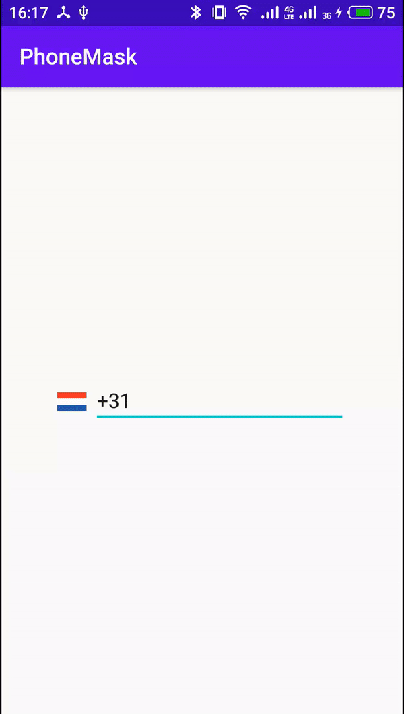
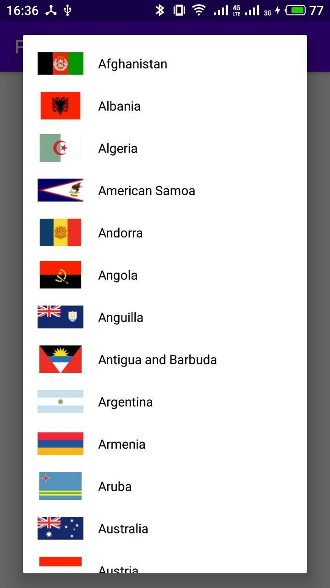

# PhoneMask

#### The library recognizes telephone codes of countries and sets the required format

   

This project using [Decoro](https://github.com/TinkoffCreditSystems/decoro) for mask setting


# Installation

```
dependencies {
    implementation 'ru.vvdev.phonemask:phonemask:$latestVersion'
}
```
# Usage

```
    <ru.vvdev.phonemask.PhoneView
        android:id="@+id/etPhone"
        android:layout_width="match_parent"
        android:layout_height="wrap_content"
        app:defaultCode="+33" />

```

You can set the default format

`app:defaultCode="+33"`
